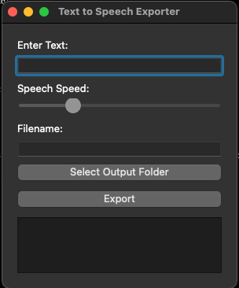
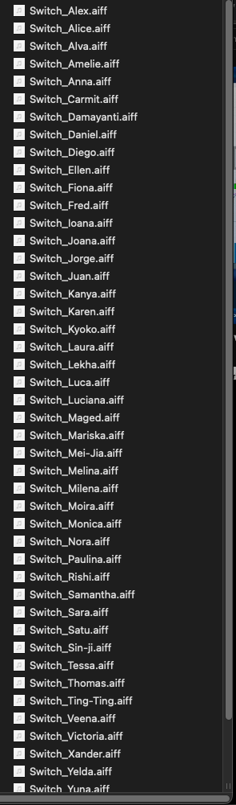

# Say All
A simple Python GUI Program that exports a word or phrase in all the available mac system voices into multiple files

Using Pyqt (you will need to install PyQT)

How to use: 
enter the phrase to say.
enter a file name.
choose a locatoin to export the files.
click export and it will save the spoken phrase in every voice in multiple files in .aiff format.

boom tonnes of samples for nothing. 

